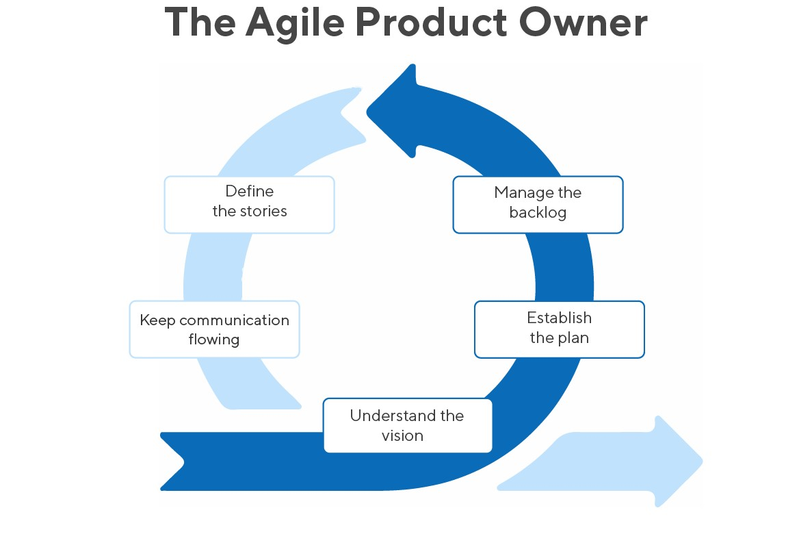
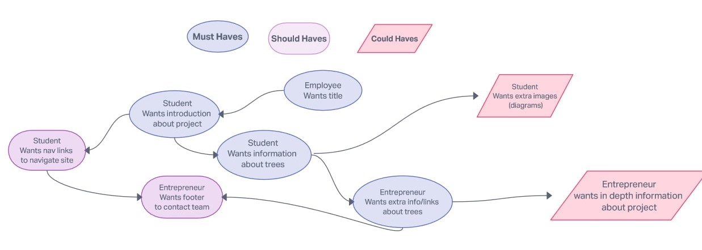

# Backlog

In Agile development, a product backlog is a prioritized list of deliverables,
(such as new features) that should be implemented as part of a project or
product development. It's a decision-making artifact that helps you estimate,
refine, and prioritize everything you might sometime in the future want to
complete.

## Must-Haves

> These are necessary for basic usability:

- **Employee**: I want to clearly see what the site is about.

  [ ] there is a clear title at the top of the page.

- **Student**: I want to be able to read an introduction about this project.

  [ ] There is a section under the navbar describing the project's goal.

- **Student**: I want to be able to get information to learn about trees.

  [ ] There is a main text in the page with information and links about trees.

- **Entrepreneur**: I can gather extra information about trees.

  [ ] There is a section with links available to gather more information about
  trees.

## Should-Haves

> This will complete the user experience, but are not necessary:

- **Student**: As a student I want to be able to easily navigate the website.

  [] There is a navbar at the top of the page, that links to different sections.

- **Entrepreneur**: I want to be able to contact the team to get more
  information about the project.

[ ] There is a footer with contact links.

## Could-Haves

> This would be really cool ... if there's time:

- **Student**: I would like to see more diagrams about trees.

  [] There are more useful images about trees

- **Entrepreneur**: I want to have even more information about this project.

[] There is more in depth content which gives information about the project.

## Story Sequencing

