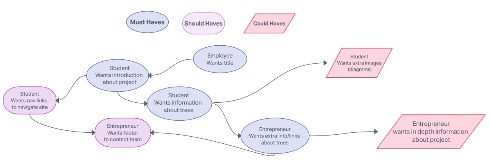

# Backlog

## Must Haves

In Agile development, a product backlog is a prioritized list of deliverables,
(such as new features) that should be implemented as part of a project or
product development. It's a decision-making artifact that helps you estimate,
refine, and prioritize everything you might sometime in the future want to
complete.

- **Home Page**

  - As a Student I want to get all the information related to tree
    - [ ] _there should title at the top of the web page_
    - [ ] _there should be a link from where I can explore more_
  - As an Entrepreneur I want to find info how can contribute towards
    environment

    - [ ] _there should be a section describing importance of tree for business_

> These are necessary for basic usability:

- **Employee**: I want to clearly see what the site is about.

- [ ] there is a clear title at the top of the page.

- **Student**: I want to be able to read an introduction about this project.

- [ ] There is a section under the navbar describing the project's goal.

- **Student**: I want to be able to get information to learn about trees.

- [ ] There is a main text in the page with information and links about trees.

- **Entrepreneur**: I can gather extra information about trees.

- [ ] There is a section with links available to gather more information about
      trees.

  - As an Employee I would like to plant tree
    - [ ] _there is a section describing plantation_
  - As a user I can learn even more about trees
    - [ ] _there is an aside with links for further reading_

## Should Haves

- **Home Page**
  - As a student I can navigate the web page from a navbar
    - [ ] _there is a navbar at the top of the page with links to the different
          sections_
  - As a user I can contact us to learn more about our project
    - [ ] _there is a footer with contact info_

> This will complete the user experience, but are not necessary:

- **Student**: As a student I want to be able to easily navigate the website.

- [ ] There is a navbar at the top of the page, that links to different
      sections.

- **Entrepreneur**: I want to be able to contact the team to get more
  information about the project.

- [ ] There is a footer with contact links.

## Could Haves

- **Home Page**
  - as a user I can find link to contribute towards society
    - [ ] _there should be some info related to bank transfer_

> This would be really cool ... if there's time:

- **Student**: I would like to see more diagrams about trees.

- [ ] There are more useful images about trees

- **Entrepreneur**: I want to have even more information about this project.

- [ ] There is more in depth content which gives information about the project.

## Story Sequencing

